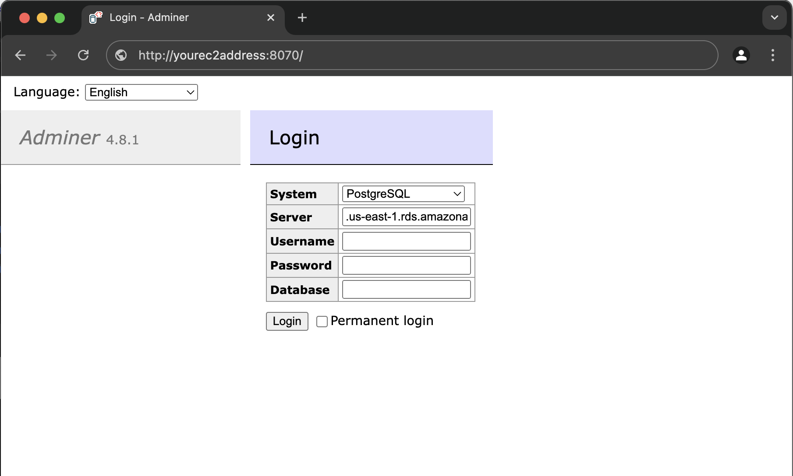

# Ensure your AWS RDS parameter group is configed as follows:

rds.force_ssl should be set as 0

# Edit your environment variable in the .env file

# Run the following command to uninstall all conflicting packages:
```
for pkg in docker.io docker-doc docker-compose docker-compose-v2 podman-docker containerd runc; do sudo apt-get remove $pkg; done
```

# Add Docker's official GPG key:
```
sudo apt-get update
sudo apt-get install ca-certificates curl
sudo install -m 0755 -d /etc/apt/keyrings
sudo curl -fsSL https://download.docker.com/linux/ubuntu/gpg -o /etc/apt/keyrings/docker.asc
sudo chmod a+r /etc/apt/keyrings/docker.asc
```
# Add the repository to Apt sources:
```
echo \
  "deb [arch=$(dpkg --print-architecture) signed-by=/etc/apt/keyrings/docker.asc] https://download.docker.com/linux/ubuntu \
  $(. /etc/os-release && echo "$VERSION_CODENAME") stable" | \
  sudo tee /etc/apt/sources.list.d/docker.list > /dev/null
sudo apt-get update
```

# To install the latest version, run:
```
sudo apt-get install docker-ce docker-ce-cli containerd.io docker-buildx-plugin docker-compose-plugin
```

# Enable the docker to run as a daemon
```
sudo systemctl enable docker
```

# run docker commands without sudo
```
sudo groupadd docker
sudo usermod -aG docker $USER
sudo chown $USER /var/run/docker.sock
newgrp docker
```

# Initialize and create a database in your RDS database
```
docker run -v ./backend/db/init.sh:/init.sh --env-file .env --rm postgres:latest ./init.sh
```

# Run your container
```
cd ITP4606
docker compose up
```

